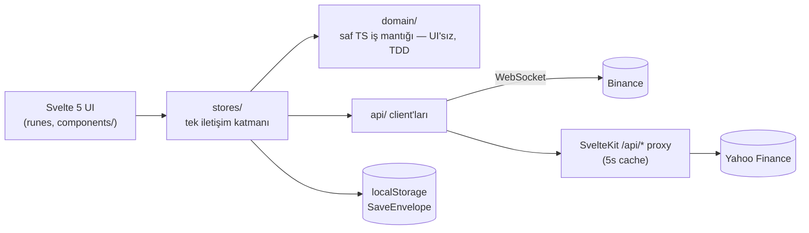

# Miras Oyunu

[](https://github.com/rudukan/miras/actions/workflows/ci.yml)

**🎮 Canlı: [miras-one.vercel.app](https://miras-one.vercel.app)**

Hiç tanımadığın büyük amcandan 1.000.000 USD miras kaldı. Türkiye'nin makro koşullarında — kur, enflasyon, BIST, ABD borsası, kripto, altın — bu parayı **gerçek zamanlı piyasa verisiyle** işletiyorsun. Bloomberg-terminali estetiğinde, tarayıcıda çalışan bir finansal simülasyon/tycoon oyunu.

> **EN summary:** A browser-based financial simulation game: manage a $1M inheritance under Turkey's macro conditions with real-time market data (BIST, US stocks, crypto, gold, FX). SvelteKit 2 + Svelte 5 + strict TypeScript. Pure-TS domain layer built with TDD (471 tests incl. a 1000-seed Monte Carlo winnability simulation), CI on every push.

## Mühendislik kararları

- **Para asla `number` değil** — tüm parasal değerler [`Money`](src/lib/domain/money.ts) tipiyle taşınır; float aritmetiği kaynaklı kuruş kaymaları sınıf olarak yok edildi.
- **Eşikli mühürlü kur** — canlı USD/TRY her saniye oynar; net servetin gürültüyle titrememesi için kur günde bir "mühürlenir", ama mühürden %0.75+ sapan *gerçek* hareket aynı gün yeniden mühürlenir ([`liveGameStore`](src/lib/stores/liveGameStore.svelte.ts)). Gürültü bastırma ile doğruluk arasında bilinçli bir orta yol.
- **1000-seed Monte Carlo kazanılabilirlik simülasyonu** — oyun dengesi tahminle değil istatistikle doğrulanır: her strateji arketipi (temkinli/dengeli/agresif) 1000 rastgele tohumla koşulur, kazanma oranının %30-70 hedef bandında kaldığı test edilir ([`tests/balance/winnability.test.ts`](tests/balance/winnability.test.ts)). Her push'ta CI'da koşar.
- **Hibrit canlı veri** — kripto Binance WebSocket (birincil) + snapshot fallback; BIST/altın/döviz Yahoo Finance üzerinden 5s cache'li SvelteKit proxy (rate-limit koruması). Feed koptuğunda otomatik geri düşüş; oyun kesintisiz sürer.
- **DST-duyarlı borsa takvimi** — NYSE ve BIST seans saatleri, ABD yaz saati geçişleri ve tatil takvimi dahil gerçek kurallarla modellenir ([`domain/calendar`](src/lib/domain/calendar/)).
- **Canlı ABD hisse araması** — statik katalog yerine Yahoo canlı arama API'sini saran proxy: kullanıcı herhangi bir NYSE/NASDAQ sembolünü arayıp portföyüne ekleyebilir (debounce + race-condition koruması).

## Mimari



- `src/lib/domain/` — çekirdek iş mantığı: framework'süz, saf TypeScript, her modül tek sorumlu, testleri yanı başında. UI olmadan da çalışır/test edilir.
- `src/lib/stores/` — sistemler arası **tek** iletişim kanalı (Svelte 5 runes).
- `src/routes/api/` — dış API'lere sunucu tarafı proxy'ler: anahtar/köken gizleme + cache + tek çıkış noktası.
- Deploy: `main`'e push → CI → Vercel otomatik prod.

## Test & doğrulama

- **471 test** (Vitest): domain birim testleri + API proxy testleri + Monte Carlo denge simülasyonu — her push'ta [CI](https://github.com/rudukan/miras/actions)'da.
- `svelte-check` strict TypeScript, 0 hata toleransı.
- Playwright E2E critical path ve erişilebilirlik geçişi yol haritasında.

## Geliştirme süreci

Bu proje AI destekli ama mühendislik disipliniyle yürütülüyor: her önemli dilim önce **spec** ve **uygulama planına** dönüşür ([`docs/superpowers/`](docs/superpowers/)), uygulama **TDD** ile yapılır, kararlar ve gerekçeleri [`memory.md`](memory.md)'de yaşar. Tasarım kararlarının *neden*'i de kod kadar versiyonludur.

## Yol haritası (özet)

Sırada: Supabase (Auth + Postgres + RLS) ile hesap altyapısı → haftalık lig (Pazartesi $1M reset, Cuma kapanışta skor kilidi) → satirik "mahkeme beratı" paylaşım kartı. Detay: [`memory.md`](memory.md) §4.

## Çalıştırma

```bash
npm install
npm run dev     # http://localhost:5173
npm run test    # Vitest
npm run check   # svelte-check (TS strict)
```

## Lisans & haklar

Kaynak kod, mühendislik yaklaşımını göstermek amacıyla **vitrin olarak** açıktır. "Miras Oyunu" adı, oyun tasarımı, içeriği ve görselleri üzerindeki **tüm haklar saklıdır** — kod ve içerik, yazılı izin olmadan kopyalanamaz, yayınlanamaz veya ticari amaçla kullanılamaz.

*Bu bir oyundur; hiçbir içeriği yatırım tavsiyesi değildir.*
